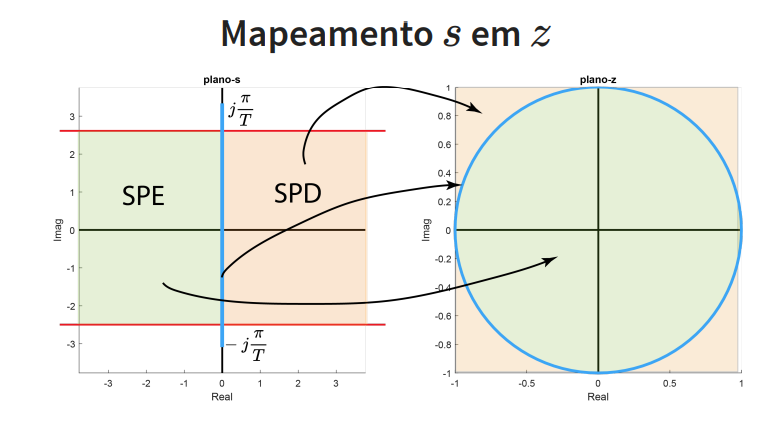
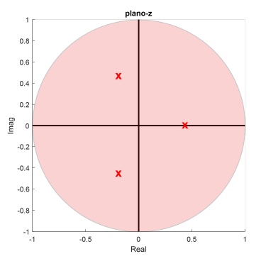

# 📘 Análise de Sistemas de Controle em Tempo Discreto 📘 #
> Neste resumo, encontra-se a análise de sistemas de controle digitais no plano-z. Tal análise servirá de suporte para o projeto de controladores digitais. 
---
# 1 - Revisão: do plano-s para o plano-z # 

Nesta parte do conteúdo, é esperado que você já saiba que: 
* O semiplano esquedo do plano-s é mapeado no interior do círculo unitário no plano-z;
* Linhas verticais no plano-s com $\sigma$ = $\xi$ $\omega_{n}$ constante, são mapeadas em circunferências concêntricas à origem no plano-Z.
* Linhas horizontais no plano-s com $\omega_d$ constante, são mapeadas em linhas radiais no plano-z;
* Linhas radiais no plano-s com $\xi$ constante são mapeadas em espirais no plano-z.

---

# 2 - Análise da Estabilidade # 

Para a análise da estabilidade de um sistema, primeiro, vamos exemplificar o que foi constuído no tópico 1 deste resumo, com a imagem abaixo: 

<p align="center">
  
</p>
<p align="center"><em> Mapeamento de S em Z </em></p>

Logo, suponha que temos um sistema em malha fechada. Sabemos que a Função de transferência em malha fechada é dada por: 

$$
Gf(s) = \frac{G(s)}{1+G(s)}
$$

A estabilidade deste sistema é determinada pela localização dos polos de malha fechada, obtidos pela solução da seguinte equação característica: 

$$
1 + G(s) = 0
$$

O sistema é absolutamente estável se os polos possuírem a parte real negativa, pertencendo ao semiplano esquerdo do plano-s, exemplificado na imagem abaixo. Isso é como analisamos quando estamos no domínio-s. 

<p align="center">
  
</p>
<p align="center"><em> Estabilidade do Sistema no plano-s </em></p>

Quando nos referimos a um sistema discreto, o sistema será estável se o mesmo pertencer dentro do círculo unitário, como mostra a figura abaixo: 

<p align="center">
  
</p>
<p align="center"><em> Estabilidade do sistema no plano-z </em></p>

--- 
# Exemplos de códigos em MATLAB para verificação da estabilidade do sistema # 
## Exemplo 01 ## 
Considere a seguinte função discreta: 

$$
f[n] = 10 - 5e^{-5nTs}
$$

Calcule a transformada-z desta função. 

### Resolução ### 
```matlab
close all %fecha todas janelas
clear all %limpa memoria
clc %limpa command window
%% Definindo a função f[n]
syms T n %define variaveis simbolicas
f_n=10−exp(−5*n*T); %define sinal
%% Calculando a transformada-z %%
F_z=ztrans(f_n); %obtem transformada Z
pretty(F_z)% exibe equacao da transf. Z numa forma "bonita"
```

## Exemplo 02 ## 
Considere a seguinte função: 

$$
F(z) = \frac{z}{z-1/3}
$$

Calcule a transformada-z inversa.

### Resolução ###

A transformada Z inversa de F(z) pode ser obtida usando o Matlab da seguinte forma: primeiramente defina a equação literal no Matlab, para definir a variável, e outras variáveis que existirem na equação, utilize o comando **syms**. Em seguida, utilize o comando **iztrans**. Apos encontrar a transformada Z inversa, pode-se visualizar o sinal no tempo discreto usando o comando **subs**. O código em questão apresenta-se abaixo: 
```matlab
close all %fecha todas janelas
clear all %limpa memoria
clc %limpa command window
%%
syms z %define variaveis simbolicas
F_z = z/(z−1/3); %define eq da transf. Z
f_n=iztrans(F_z); %obtem transf. z inversa
pretty(f_n) %exibe na tela de forma "bonita"
td=1:10; %cria vetor de tempo discreto
figure
stem(td,subs(f,'n',td)) %exibe sinal em tempo discreto
```
