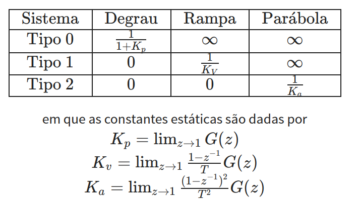

# 📘 Projeto de Controladores 📘 #
> Neste resumo, encontra-se o projeto de controladores e como atender aos critérios pré-estabelecidos. Aqui você vai encontrar os critérios de desempenho, projeto por emulação, projeto em z e exemplos. 

---
# 0 - Revisão # 
Antes de começarmos de fato nosso resumo, é importante ressaltar alguns pontos que são importantes para a leitura. Primeiramente, precisa-se recordar como medimos o desempenho de um sistema. 

Nela, temos dois tipos: características transitórias e em regime permanente. Em relação às características transitórias, temos: 
* Tempo de subida (*Raising time* - tr);
* Tempo de pico (tp);
* Sobressinal (*Overshoot* - Mp);
* Tempo de acomodação (ts).

Já em relação às características em regime permanente, temos: 
* Erro de posição (degrau);
* Erro de velocidade (rampa);
* Erro de aceleração (parábola). 

Vale ressaltar que as características em regime permamente, dependem dos polos da função de excitação. 

# 1 - Projeto e Discretização de controladores em tempo contínuo # 
Em muitos casos, controladores digitais são obtidos diretamente pela discretização de controladores projetados por técnicas tradicionais em tempo contínuo. Quando a fs é alta, o desempenho do sistema em MF não é afetado. 
No entanto, em casos que a fs não é muito alta, pode-se ocorrer perdas de desempenho

## 1.1 - Efeito da Amostragem e do ZOH ## 

O processo de amostragem e o ZOH **introduzem um atraso na resposta do sistema**. Se tal atraso for considerável em relação às maiores constantes de tempo do sistema, o desempenho pode ser comprometido. 

## Tipo do sistema ## 
O número de polos na orgigem do sistema define o tipo. Sistemas: 
* Tipo 1: Erro nulo para a entrada em degrau;
* Tipo 2: Erro nulo para a entrada em degrau e rampa;
* Tipo 3: Erro nulo para a entrada em degrau, rampa e parábola.

<p align="center">
  
</p>
<p align="center"><em> Resumo dos tipos </em></p>

# Exemplos - MATLAB # 
## Exemplo 01 ##
Considere a função de transferência G(z) e um período de amostragem Ts = 0.5s. Pelos erros de regime permanente, pode-se concluir que esse sistema é do tipo 0, 1, 2 ou 3 ? 
$$
G(z) = \frac{0.0912z^3 - 0.0012z^2 - 0.0544z}{z^4 - 2.655z^3 + 2.679z^2 -1.391z + 0.3679}
$$

### Resolução ###

Definindo a função de transferência:
```matlab
numz = [0.0912 -0.0012 -0.0544 0];
denz = [1 -2.655 2.679 -1.391 0.3679];
Ts = 0.5;
Gf = tf(numz, denz, Ts);
```
Respota ao degrau:
```matlab
td=0:Ts:100; %vetor de tempo discreto
y1=step(Gf,td); %respota ao degrau
figure(1)
stairs(td,y1,'LineWidth',2);
title('Atividade 01 - Resposta ao Degrau')
xlabel('t (s)')
ylabel('Amplitude')
hold on
line([0 20],[1 1],'linestyle','--','color','red')
```
Respota a rampa:
```matlab
figure(2)
r=td'; %sinal de entrada (rampa)
stairs(td,td,'k--')
y_ramp=lsim(Gf,r,td); %simula entrada de sinal rampa
stairs(td,y_ramp,'LineWidth',2)
title('Atividade 01 - Resposta a Rampa')
xlabel('t (s)')
ylabel('Amplitude')
figure(3)
plot(r-y_ramp) %mostra sinal de erro (desvio de controle)
title('Atividade 01 - Erro na rampa')
```
Resposta a parábola:
```matlab
figure(4)
r=td.*td; %sinal parabola
r=r'; %transposto para tornar vetor coluna
plot(td,td.^2,'k--')
hold on
y_parab=lsim(Gf,r,td); %simula sinal de entrada tipo parabola
stairs(td,y_parab,'--r')
title('Atividade 01 - Resposta a Parábola')
xlabel('t (s)')
ylabel('Amplitude')
figure(5)
plot(r-y_parab) %mostra sinal de erro
title('Atividade 01 - Erro na Parábola')
```
**Resposta**: Analisando os gráficos, concluímos que o a função de transferência é do tipo 0, uma vez que os gráficos de rampa e parábola apresentam erros não nulos. 
